# 🛒 Ekart - CI Pipeline

This repository implements a **Continuous Integration (CI) pipeline** for a Java-based shopping cart application using Jenkins, Maven, SonarQube, OWASP Dependency-Check, and Docker.

---

## 📦 Tech Stack

- **Jenkins** – Automation server for CI/CD.
- **Maven** – Java build and dependency management.
- **SonarQube** – Static code analysis and quality gate checks.
- **OWASP Dependency-Check** – Detects vulnerabilities in dependencies.
- **Docker** – Containerization for consistent deployments.
- **GitHub** – Source code hosting.
- **Docker Hub** – Image registry for Docker builds.

---

## 🔁 Pipeline Stages

### 1. **Git Checkout**
- Clones the `main` branch from the Ekart repository.

### 2. **Compile using Maven**
- Runs `mvn clean compile` to compile the Java application.

### 3. **SonarQube Analysis**
- Performs static code analysis using SonarQube.
- Publishes quality metrics like code smells, bugs, and coverage.

### 4. **OWASP Dependency-Check**
- Scans project dependencies for known vulnerabilities.
- Generates and publishes a detailed security report.

### 5. **Build using Maven**
- Builds the project and generates the final JAR/WAR.
- Skips running tests in this stage (`-DskipTests=true`).

### 6. **Docker Build & Push**
- Builds a Docker image from the `docker/Dockerfile`.
- Tags and pushes the image to Docker Hub under `<DockerUsername>/shopping:latest`.

### 7. **Trigger CD Pipeline**
- Triggers a downstream CD pipeline (`CD-Pipeline`) to handle deployment.

---

## ⚙️ Prerequisites

Make sure your Jenkins server has the following:

- Java 11 (`jdk11`) installed and configured.
- Maven 3 (`maven3`) installed.
- SonarQube server accessible (e.g., `http://20.244.106.132:9000`).
- SonarQube authentication token stored in Jenkins Credentials.
- Docker installed on the Jenkins agent.
- Docker Hub credentials stored in Jenkins.
- OWASP Dependency-Check plugin installed and configured (`odcInstallation: 'DP'`).

---

## 🔐 Secure Credential Management

- Replace hardcoded SonarQube tokens with Jenkins **Credentials (Secret Text)**.
- Use `withCredentials` block for secure usage in pipeline scripts.

---
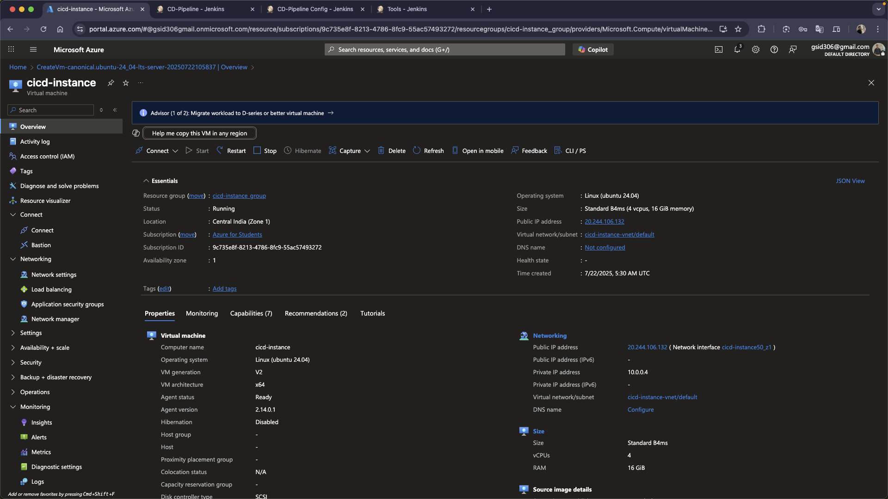
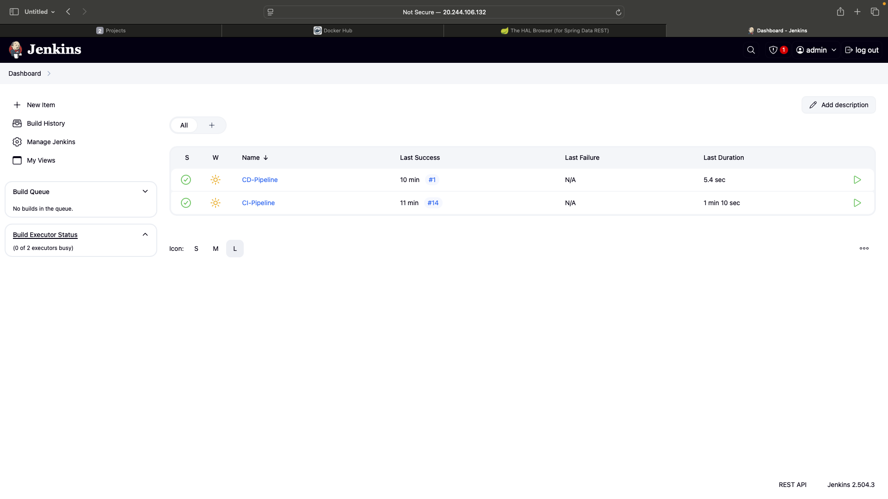
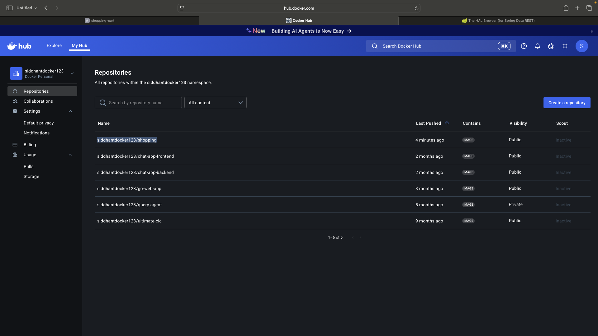
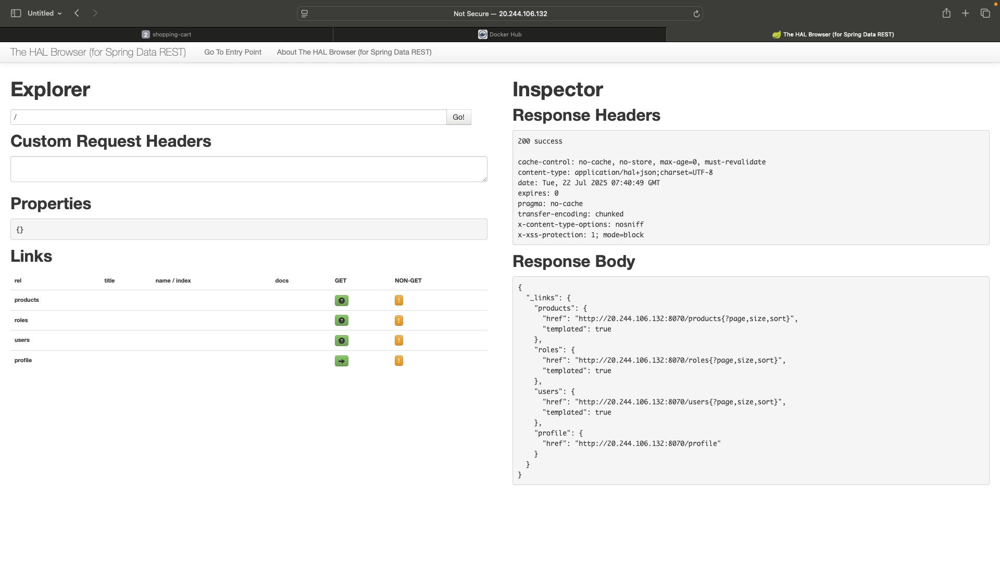
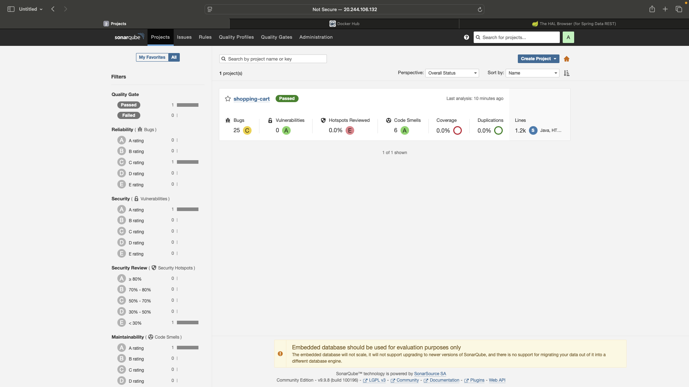
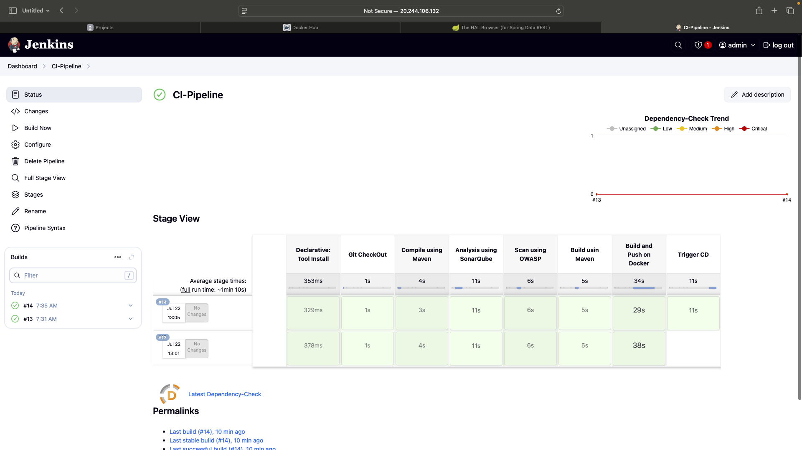
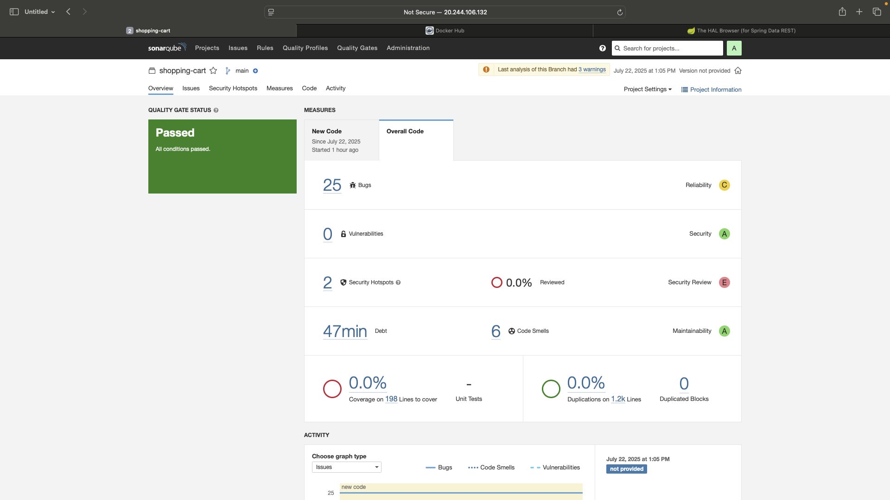
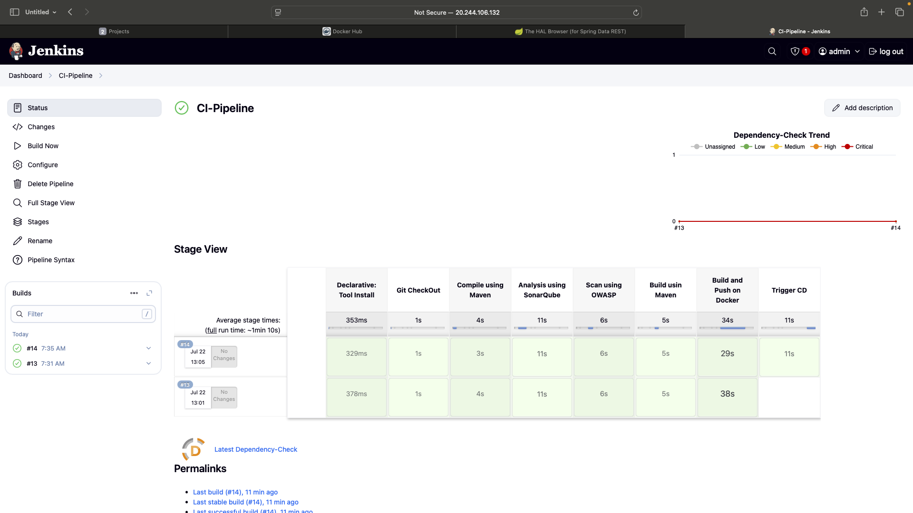
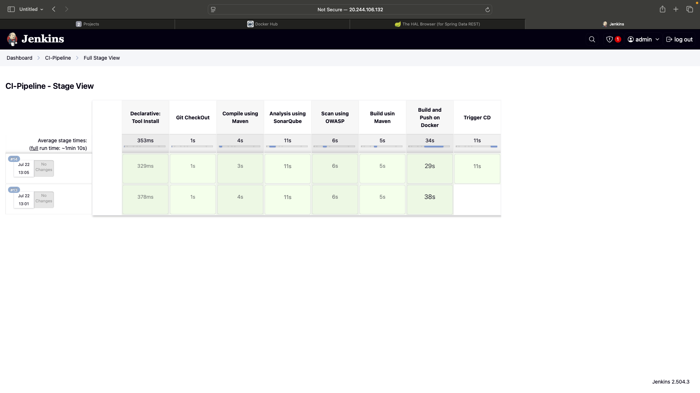
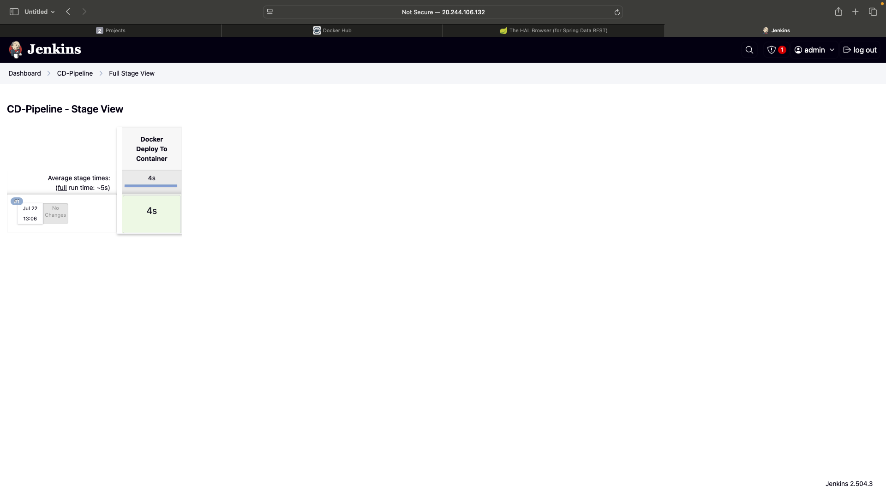
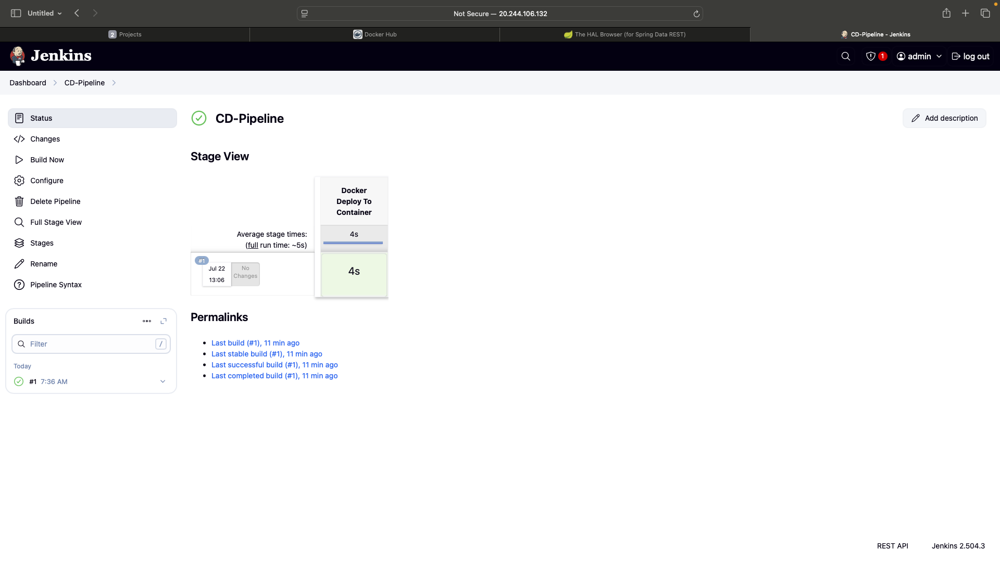
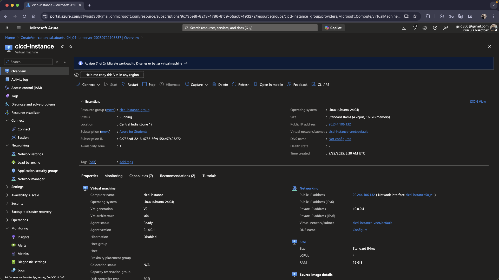

